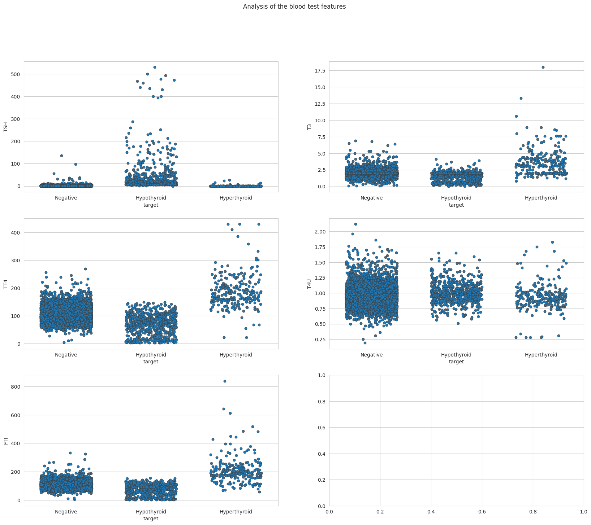

# Thyroid-disease-medical-diagnosis-prediction
Multiclass classification

## Objective:
To predict thyroid disease medical diagnosis

### Business problem:
   Thyroid disease is a common endocrine disorder that can affect people of all ages. It is caused by a problem with the thyroid gland, which is a small gland located in the neck. The thyroid gland produces hormones that regulate metabolism, growth, and development.

There are two main types of thyroid disease:

- Hypothyroidism occurs when the thyroid gland does not produce enough thyroid hormone.
- Hyperthyroidism occurs when the thyroid gland produces too much thyroid hormone.

Both hypothyroidism and hyperthyroidism can cause a variety of symptoms, including fatigue, weight gain or loss, changes in heart rate, and mood changes. If left untreated, thyroid disease can lead to serious health problems, such as heart disease, stroke, and infertility.

Early diagnosis and treatment of thyroid disease is important to prevent complications. However, thyroid disease can be difficult to diagnose because the symptoms are often vague and can be caused by other conditions.

In this project, we will develop a machine learning model to classify patients as having hypothyroidism, hyperthyroidism, or normal thyroid function. The model will be trained on a dataset of patient records that includes thyroid hormone levels and other clinical features.

We will use a variety of machine learning techniques, including preprocessing, feature selection, dealing with imbalanced data, modeling, and evaluation. We will also compare the performance of different machine learning algorithms and tuning parameters to develop the best possible model.

Once the model is developed, we will evaluate its performance on a held-out test set. The goal is to develop a model that is accurate and reliable, and that can be used to help diagnose thyroid disease in patients.

This project has the potential to improve the diagnosis and management of thyroid disease. By developing an accurate and reliable machine learning model, we can help clinicians identify patients with thyroid disease earlier and more accurately. This can lead to better outcomes for patients and reduce the risk of complications.

### Targeted stakeholders:
  Doctors, Hospitals, Pharmaceutical companies, Research Institutes and Ministry of Health (social aid, social health assurance, health national projects,...)

### Source of dataset:
Thyroid Data - https://archive.ics.uci.edu/ml/datasets/thyroid+disease , https://www.kaggle.com/datasets/emmanuelfwerr/thyroid-disease-data , https://www.kaggle.com/datasets/emmanuelfwerr/thyroid-disease-data

For this dataset, there are 9172 rows and 30 columns.

### Brief description of data:
The datasets featured were created by reconciling thyroid disease datasets provided by the UCI Machine Learning Repository of patient background information and blood test results along with thyroid-related medical diagnosis

- What is the target column?
target - hyperthyroidism medical diagnosis (str).

## Methods
To prepare this data, the data was cleaned, and the following processes were performed:
### Exploratory Data Analysis
    - During the exploratory data analysis, boxplots and histograms were visualized for numeric datatype column. 
    - Also, barplots were visualized for categorical column. 
    - This gave a good baseline for all of the numeric and categorical columns for univariate EDA.

#### Visual 1 
 

> This pie chart shows that in this dataset only 3.75% person are reported to be sick.

## Results
 ### Expanatory Data Analysis
    - To visualize the data for explantory purposes, countplots, pie chart, histogram and stripplot were used. 

#### Visual 2 

>Who is most affected by thyroid disease?
>From this histogram, we can see that the distribution is left-skewed distribution and that most of the patient reported with thyroid problem are between 55 years old and 75 years old, with a peak around 60-65 years old.

#### Visual 3 

>Who is most affected by thyroid disease?
>Most of the patient with thyroid problem are female (67.4%).

#### Visual 4 

>The analysis of the prescribed treatment shows that main treatment is the thyroixine with 13.5 % patient taking it, followed by the I131 treatmant (1.8%), then doing surgery to remove the thyroid (1.5%) and finally anti-thyroid medications (1.3%).

#### Visual 5 

>The distribution of the medical diagnosis is right-skewed distribution. the majority of the patient were diagnosed as concurrent non-thyroidal illness.
>
>In case of hypotheroid:
>
- around 360 patients were reported to have a compensated hypothyroid (G).
- 49 patients were reported consistent with compensated hypothyroid and more likely concurrent non-thyroidal illness (GK).
- 10 patients were reported consistent with compensated hypothyroid and more likely having increased binding protein (GI)
- 1 patient was reported consistent with compensated hypothyroid, more likely concurrent non-thyroidal illness and and having decreased binding protein (GKJ).
- 233 patients were primary hypothyroid (F).
- 6 patients were reported consistent with primary hypothyroid and more likely concurrent non-thyroidal illness (FK)
- 1 patient was with hypothyroid (E).
- 8 patients were reported consistent with secondary hypothyroid but more likely concurrent non-thyroidal illness (H|K )
>
>In case of hypertheroid:
>
- 147 patients were diagnosed with hyperthyroid (A).
- 46 were reported consistent with hyperthyroid but more likely concurrent non-thyroidal illness (AK)
- 21 patients were reported to have T3 toxic (B).
- 6 patients were diagnosed with toxic goitre (C).
- 12 patients were reported consistent with having toxic goitre but more likely having increased binding protein (C|I).
- 8 patients were reported having secondary toxic (D).
- 1 patient was reported consistent with having secondary toxic but more likely there is a discordant assay results (D|R).

Moving forward with the analysis it has been decided to only keep the observations for patients with diagnosis either negative, hyperthyroid, or hypothyroid. This is because they are the most prevalent observations and the focus of this project. The other classes were dropped from the dataset upon import and thus we are left with ~7500 unique entries in the dataset.

The main reason for dropping the other classes is that they are not important to our focus because either they don't relate to thyroid disease (for example discordant results), or they refer to a treatment (for example undergoing replacement therapy). Another big, probably more important, reason is that they create noise in our data. Our most important attributes are the blood test results of hormone levels. The other target classes referring to treatments and other conditions blurr barriers between classes.

#### Visual 6 

>From the chart pie, we can see that patients with hypothyroid represent 8.7% while patients with hyperthyrois represent 3.1%.

#### Visual 7 

>In both hypothyroid and hyperthyroid diagnosis, women represent the highest percentage compared to men.

#### Visual 8 

>From the dataset:
>- 2.7% of the patient have a tumor including 0.2% with hypothyroid and 0.4% with hypertheroid,
>- 1.0% only have goitre all of them have no thyroid problem, 
>- none of the patients have hypopituitary.

#### Visual 9 

>For TSH: TSH level is higher than normal in case of hypothyroid disease.
>for T3: T3 level is higher than normal in case of hyperthyroid disease for some patients.
>for TT4: TT4 level is higher than normal in case of hyperthyroid and lower in case of hypothyroid patients.
>for T4U: the level of T4U is almost the same for all 3 categories.
>
>for FTI: the level of FTI is higher than normal in case of hyperthyroid and lower in case of hypothyroid.
>What is TSH measurement? What are scientifically established normal values? A high TSH level indicates that the thyroid gland is not making enough thyroid hormone (primary hypothyroidism). On the other hand, a low TSH level usually indicates that the thyroid is producing too much thyroid hormone (hyperthyroidism). TSH normal values are 0.5 to 5.0 mIU/L.
>
>What is T3 measurement? What are scientifically established normal values? A Total T3 test measures the bound and free fractions of triiodothyronine. Hyperthyroid patients typically have an elevated Total T3 level. T3 tests can be used to support a diagnosis of hyperthyroidism and can determine the severity hyperthyroidism. A normal Total T3 level in adults ranges from 80-220 ng/dL.
>
>What is TT4 measurement? What are scientifically established normal values? A Total T4 test measures the bound and free thyroxine (T4) hormone in the blood. Total T4 levels are affected by medications and medical conditions that change thyroid hormone binding proteins. Estrogen, oral contraceptive pills, pregnancy, liver disease, and hepatitis C virus infection are common causes of increased thyroid hormone binding proteins and will result in a high Total T4. Oppositely, Testosterone or androgens and anabolic steroids are common causes of decreased thyroid hormone binding proteins and will result in a low Total T4. A normal Total T4 level in adults ranges from 5.0 to 12.0μg/dL.
>
>What is T4U measurement? What are scientifically established normal values? T4U tests measure thyroxine (T4) utilization rate in the body. They can help measure how well the body is utilizing T4 hormone.
>
>What is FTI measurement? What are scientifically established normal values? A Free T4 Index measures what is not bound and able to freely enter and affect the body tissues. Tests measuring free T4 index (FTI) usually more accurately reflect how the thyroid gland is functioning. FT4 normal values are 0.7 to 1.9ng/dL.
>
>We do not know the units that the different hormone blood measurements in our dataset use. But knowing about what these levels are usually for individuals can help us tremendously in understanding our dataset. As well as making hypothesis of the units that are used in the dataset and detecting Outliers/inconsistencies.

#### Visual 10 

>In the diagonals of the pairplot we can see the distributions of each numeric variable with respect to one another.
>We can observe that for some Hormone test vs others, there are nice clusters that form. This is encouraging because it means that they do a good job at separating out each of our target classes:
>- FTI vs T3
>- FTI vs T4U
>- FTI vs age
>- T4U vs TT4
>- TT4 vs age
>- TT4 vs T3
> There is a positive correlation between FTI, T3, and TT4. When one of them increase the others increase as well. hypothyroid patients have a low level of FTI, T3 and TT4, while hyperthyroid patients have a higher level compared to normal. 
>It is apparent how unbalanced the dataset is, with so many negative 'target' compared to hypothyroid or hyperthyroid. but we knew this from the start and It is normal for this type of data. We will have to treat with resampling protocol or using models that handle this well : XGBoost and LightGBM would be a good options.

## Model
 ### Maching Learning Using the Following Models:
    >Three prediction models were tested:
       >- eXtreme Gradient Boosting
       >- LightGBM
       >- GradientBoostingClassifier

 ### Models Evaluated & Results
 
>LightGBM model gave the best results with:
- Accuracy = 0.99 
- Precision = 0.94
- Recall = 0.93
- F1-score = 0.93
  
- Number of patients that are healthy but predicted to have hypothyroid (false positive): 0.12%.
- Number of patients that are healthy but predicted to have hyperthyroid (false positive): 0.65%.
- Number of patients that have hypothyroid but predicted to be healthy (false negative): 4.10%.
- Number of patients that have hypothyroid but predicted to have hyperthyroid : 0%.
- Number of patients that have hyperthyroid but predicted to be healthy (false negative): 14.54%.
- Number of patients that have hyperthyroid but predicted to have hypothyroid: 0%.

>LightGBM model produced good results without the need of any technique to deal with imbalanced datasets. 

## Limitation and Recommendations:
- We analyze that the feature selection technique can be effective in improving the results, but it also reduces the size of data.
- This small feature set after the selection of important features is a limitation of this study.
- Another limitation is the small size of data that urged us to considers only three classes instead of five or six target classes that will give us more specific diagnosis related to what type of hyperthyroid or hypothyroid patient have.
- Considering all these limitations, in future work, will improve thyroid disease dignosis prediction accuracy and efficiency.

## Conclusion & Next Steps
The thyroid disease prediction has been challenging, as the prior detection and evaluation of thyroid symptoms without doctor involvement are not easy. Yet, with an alarming increase in recent years, thyroid disease detection has emerged as an important medical problem and requires efficient automatic prediction models. Therefore, thyroid disease classification solutions can accurately predict the thyroid disease type like hyperthyroidism or hypothyroidism, given the machine learning models are trained with sufficient data samples.

Having additional data, will open the posibility to explore more categories in the datasets, such as, primary, secondary hypothyroid, T3 toxic, secondary toxic,...

### For further information

For any additional questions, please contact: Asma Ben Hmidene **asmabhpython@gmail.com**
